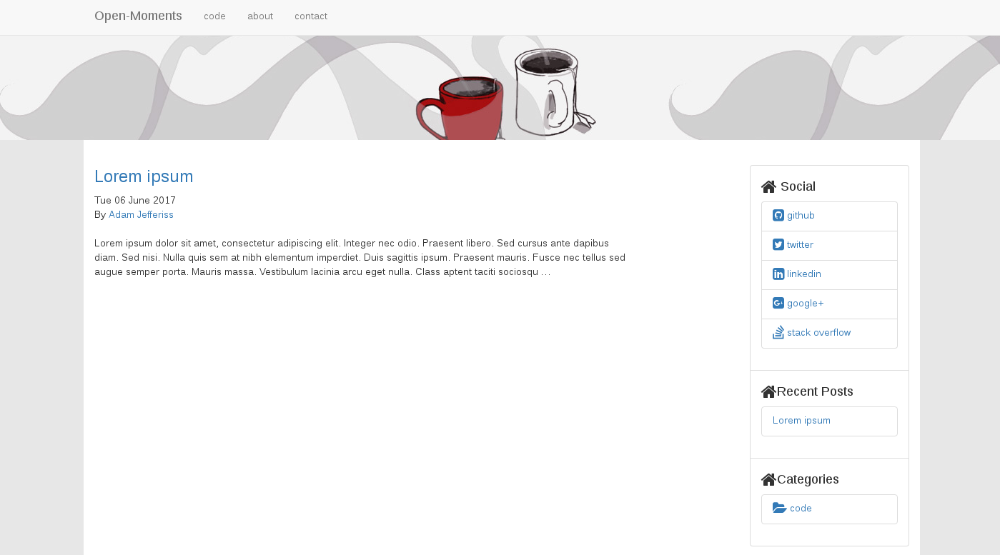

# bootstrap-brew
Light Bootstrap 3 based theme for Pelican.

## Installation
First:
`git clone https://github.com/ajefferiss/bootstrap-brew`
Then simply point the `THEME` variable in your `pelicanconf.py` to the `bootstrap-brew` checkout directory.

## Usage
This theme uses the standard Pelican settings:

* Template Settings
	* `DISPLAY_PAGES_ON_MENU`
	* `DISPLAY_CATEGORIES_ON_MENU`
	* `MENU_ITEMS`
	* `LINKS` : TODO
* Analytics & Comments
	* `DISQUS` can be used for comments by adding the `DISQUS_SITENAME` variable into either your `pelicanconf.py` or `publishconf.py` files
	* TODO

### Pygments
* TODO

### Site Branding
* TODO

### Breadcrumbs
* TODO

### Favicon
To support favicons across modern browsers, touch devices and older versions of IE three different favicons are required. For full details see the stack overflow post: [HTML 5 Favicon - Support](https://stackoverflow.com/questions/23849377/html-5-favicon-support)

For these three settings can be included in your pelicanconf.py:
* FAVICON - Should be a 196x196 px image, used by Firefox, Chrome, Safari, IE 11+ and Opera.
* FAVICON_IE - Favicon used for IE9, should be a 32x32 px images
* TOUCHICON - Favicon used by iOS and Android 2.1+, should be 180x180 px

### Sidebar
The sidebar will show the following things:
* Social Links
	* Provided via the `SOCIAL` variable see [Pelican - Settings](http://docs.getpelican.com/en/stable/settings.html)
* Categories
	* If the `DISPLAY_CATEGORIES_ON_SIDEBAR` option is set to `True` then the recent categories are show
* Posts
	* If the `DISPLAY_RECENT_POSTS_ON_SIDEBAR` option to set to `True` then the recent posts are show upto a maximum of `RECENT_POST_COUNT`
* Tags
	* If the `DISPLAY_TAGS_ON_SIDEBAR` option to set to `TRue` then tags are shown in a list, if `DISPLAY_TAGS_INLINE` is also set to `True` then a tagcloud is displayed instead.

## Screenshot

